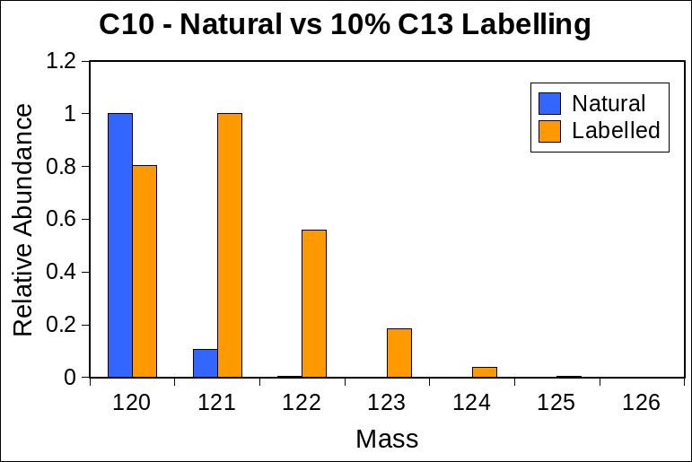

# js-emass

[](https://travis-ci.org/emptyport/js-emass)
[](https://codecov.io/gh/emptyport/js-emass)
[](https://opensource.org/licenses/MIT)
[](http://joss.theoj.org/papers/cbc6dcaf1110a965cc8c4f1efc6a0963)
[](https://zenodo.org/badge/latestdoi/131650407)


js-emass is a module for quickly and accurately calculating the isotopic envelope of a molecule.

I strongly recommend checking out the [original paper](https://www.sciencedirect.com/science/article/pii/S1044030505010160) for a better understand of how the algorithm works.

This implementation is functionally identical to the original emass, but it will provide slightly different values because this version is using the isotope data from [the isotope-abundances module](https://github.com/emptyport/isotope-abundances) which are more current than the values used in the original paper. You can, however, provide custom mass/abundance information. If you use the isotope information from the original emass, this module will give the same output.

#### Useful links:
* The original emass site - http://www.helsinki.fi/science/lipids/software.html
* A modified version of emass for easier compilation - https://github.com/princelab/emass
* A partial Ruby implementation - https://github.com/princelab/ruby-emass
* A modified Python implementation - https://github.com/JC-Price/DeuteRater
  * The core algorithm is the same as the original, but it has been integrated into a larger package that deals with peptides rather than molecular formula. 

> This implementation has been accepted for publication in the [Journal of Open Source Software!](http://joss.theoj.org/papers/cbc6dcaf1110a965cc8c4f1efc6a0963)

View this module on [npm](https://www.npmjs.com/package/js-emass).

## Installation
`npm install js-emass --save`

Additionally you can run `npm install molecular-formula --save` to be able to directly convert a formula such as "H2O" to the correct format for js-emass.

## Usage

### Quickstart
You can run the following commands interactively in the terminal by running `node` and then typing the commands, or you can place everything in a file called `script.js` for example and run it with `node script.js`. This requires that [Node.js](https://nodejs.org) be installed on your system.
```javascript
var emass_lib = require('js-emass');
var molFormula = require('molecular-formula');

var formula = new molFormula('C100');

var emass = new emass_lib();
  
isotopomers = emass.calculate(formula.composition, 0);

console.log(formula.composition);

for(var i=0; i<isotopomers.length; i++) {
    console.log('Mass: '+isotopomers[i].Mass+', Abundance: '+isotopomers[i].Abundance);
}
```
Output:
```
{ C: 100 }

Mass: 1200, Abundance: 0.92457944
Mass: 1201.003355, Abundance: 1
Mass: 1202.00671, Abundance: 0.53537855
Mass: 1203.010065, Abundance: 0.18915663
Mass: 1204.013419, Abundance: 0.04961227
Mass: 1205.016774, Abundance: 0.01030258
Mass: 1206.020129, Abundance: 0.00176431
Mass: 1207.023484, Abundance: 0.00025625
```

### Stable Isotope Labelling Example
```javascript
var emass_lib = require("js-emass");
var molFormula = require('molecular-formula');

var emassNatural = new emass_lib();
var emassLabelled = new emass_lib();

// Here we are adjusting our naturally occurring ratios.
// In a rough sense we are taking one out of every 10 12C atoms and replacing it with a 13C atom.
emassLabelled.addCustomIsotopes('C', [
  {
    "Mass": 12,
    "Abundance": 0.8893
  },
  {
    "Mass": 13.00335483507,
    "Abundance": 0.1107
  }
]);

var formula = new molFormula('C10');

var isotopesNatural = emassNatural.calculate(formula.composition, 0);
console.log("Natural isotopic envelope");
console.log(isotopesNatural);

console.log("\n");
console.log("Labelled isotopic envelope");
var isotopesLabelled = emassLabelled.calculate(formula.composition, 0);
console.log(isotopesLabelled);
```

Output
```
Natural isotopic envelope
[ { Mass: 120, Abundance: 1 },
  { Mass: 121.003355, Abundance: 0.10815728 },
  { Mass: 122.00671, Abundance: 0.0052641 },
  { Mass: 123.010065, Abundance: 0.00015183 } ]


Labelled isotopic envelope
[ { Mass: 120, Abundance: 0.80334237 },
  { Mass: 121.003355, Abundance: 1 },
  { Mass: 122.00671, Abundance: 0.56015968 },
  { Mass: 123.010065, Abundance: 0.18594303 },
  { Mass: 124.013419, Abundance: 0.04050581 },
  { Mass: 125.016774, Abundance: 0.00605059 },
  { Mass: 126.020129, Abundance: 0.00062765 } ]
```
A comparison of the distributions can be seen below. Using our example, one might add <sup>13</sup>C to their culture media to bring the relative abundance of <sup>13</sup>C to about 10%, then sample their cells at differing timepoints. Before labelling, a C10 molecule (which isn't going to be in your cells, but that we are using in this example) would have an isotopic envelope like our natural distribution in the graph below. A fully labelled C10 molecule would look like our labelled molecule below. By interpolating between the two states (e.g. calculating the isotopic envelope at 50 intervals between natural and fully labelled), one can calculate the rate at which <sup>13</sup>C is being incorporated into our molecule.


### Functions
#### calculate(formula, charge)
This function will return a list of the various peaks. The formula must be an object where each key is the elemental symbol and the value is the number of atoms. For example, water would be ```{'H':2, 'O':1}```. If you are starting with a string representation of a formula, you can use the [molecular-formula module](https://github.com/emptyport/molecular-formula) to easily obtain the object representation. The charge is optional and by default is assumed to be 0.

You will get in return a list of mass and abundance pair objects. For C100, the returned data would look like:
```
[ { Mass: 1200, Abundance: 0.92457944 },
  { Mass: 1201.003355, Abundance: 1 },
  { Mass: 1202.00671, Abundance: 0.53537855 },
  { Mass: 1203.010065, Abundance: 0.18915663 },
  { Mass: 1204.013419, Abundance: 0.04961227 },
  { Mass: 1205.016774, Abundance: 0.01030258 },
  { Mass: 1206.020129, Abundance: 0.00176431 },
  { Mass: 1207.023484, Abundance: 0.00025625 } ]
```

The abundances are normalized to the tallest peak.

#### addCustomIsotopes(c, [])
This function allows you to add custom masses/relative abundances for each element. The first argument is the elemental symbol and the second element is an array of Mass/Abundance objects.
```javascript
emass.addCustomIsotopes('H', [
    {
      "Mass": 1.0078246,
      "Abundance": 0.99985
    },
    {
      "Mass": 2.0141021,
      "Abundance": 0.00015
    }
  ]);
```

#### deleteCustomIsotope(c)
This function allows you to selectively delete any custom isotopes you may have added. This function accepts an elemental symbol as an argument.
```javascript
emass.deleteCustomIsotope('H');
```

#### clearCustomIsotopes()
This function will remove all custom isotopes at once.
```javascript
emass.clearCustomIsotopes();
```

#### setPruneLimit(f)
This function sets the pruning limit used during calculations. As the isotopic envelope is calculated, peaks with a relative abundance below the prune limit will be removed to help speed up the calculations. The default value is 1E-10.
```javascript
emass.setPruneLimit(0.000001);
```

#### setCutoff(f)
This function sets the abundance cutoff to be used on the returned values. This filtering is performed after the relative abundances have been normalized to the most intense peak. The default value is 0.0001.
```javascript
emass.setCutoff(0.000001);
```

#### setAbundanceDecimals(i)
This function sets the number of decimal places to keep for the abundance values. The default is 8.
```javascript
emass.setAbundanceDecimals(4);
```

#### setMassDecimals(i)
This function sets the number of decimal places to keep for the mass values. The default is 6.
```javascript
emass.setMassDecimals(2);
```

#### new(options)
Additionally you can pass these options in when you create a new emass object.
```javascript
var options = {
  'cutoff': 0.01,
  'limit': 1E-18, // This is the prune limit
  'abundanceDecimals': 4,
  'massDecimals': 3,
  'customIsotopes': {
    'H': {
      'Isotopes': [
        {
          "Mass": 1.0078246,
          "Abundance": 0.99985
        },
        {
          "Mass": 2.0141021,
          "Abundance": 0.00015
        }
      ]
    }
  }
};

var emass = new emass_lib(options);
```

## Tests
You can run `npm test` to run the tests after installing the development dependencies.

## Contributing
If you would like to contribute to js-emass, feel free to clone the repository, make your changes on a separate branch, and submit a pull request once all your tests are passing. Any new functionality will need to have corresponding tests to ensure everything is working as expected. [Travis-CI integration](https://travis-ci.org/emptyport/js-emass) is set up for this repository so all tests will be run automatically anytime you push your branch.

## Issues/Support
If you encounter any issues with js-emass, you can [file an issue](https://github.com/emptyport/js-emass/issues) here on Github. If your issue matches a currently open issue, feel free to add on to the existing issue rather than create a new issue. Helpful pieces of information will be your version of node (`node -v`), your version of npm (`npm -v`), and the version of js-emass (which can be found in your package.json or with `npm list`). Additionally, the script/program/piece of code you are having issues with would be much appreciated.

If you find you need help using js-emass, you can either [file an issue](https://github.com/emptyport/js-emass/issues) with your question, or you can find my email in the [package.json](https://github.com/emptyport/js-emass/blob/master/package.json) file.

## Future functionality
No future functionality is planned.

## License
This software is released under the MIT license.

The following notice appears with the original copy of emass:

>Copyright (c) 2005 Perttu Haimi and Alan L. Rockwood
>
>All rights reserved.
>
>Redistribution and use in source and binary forms,
with or without modification, are permitted provided
that the following conditions are met:
>
>    * Redistributions of source code must retain the
      above copyright notice, this list of conditions
      and the following disclaimer.
>    * Redistributions in binary form must reproduce
      the above copyright notice, this list of conditions
      and the following disclaimer in the documentation
      and/or other materials provided with the distribution.
>    * Neither the author nor the names of any contributors
      may be used to endorse or promote products derived
      from this software without specific prior written
      permission.
>
>THIS SOFTWARE IS PROVIDED BY THE COPYRIGHT HOLDERS AND
CONTRIBUTORS "AS IS" AND ANY EXPRESS OR IMPLIED WARRANTIES,
INCLUDING, BUT NOT LIMITED TO, THE IMPLIED WARRANTIES OF
MERCHANTABILITY AND FITNESS FOR A PARTICULAR PURPOSE ARE
DISCLAIMED. IN NO EVENT SHALL THE COPYRIGHT OWNER OR
CONTRIBUTORS BE LIABLE FOR ANY DIRECT, INDIRECT, INCIDENTAL,
SPECIAL, EXEMPLARY, OR CONSEQUENTIAL DAMAGES (INCLUDING, BUT
NOT LIMITED TO, PROCUREMENT OF SUBSTITUTE GOODS OR SERVICES;
LOSS OF USE, DATA, OR PROFITS; OR BUSINESS INTERRUPTION)
HOWEVER CAUSED AND ON ANY THEORY OF LIABILITY, WHETHER IN
CONTRACT, STRICT LIABILITY, OR TORT (INCLUDING NEGLIGENCE
OR OTHERWISE) ARISING IN ANY WAY OUT OF THE USE OF THIS
SOFTWARE, EVEN IF ADVISED OF THE POSSIBILITY OF SUCH DAMAGE.

## Support this project!

[](https://www.patreon.com/MikeTheBiochem)
